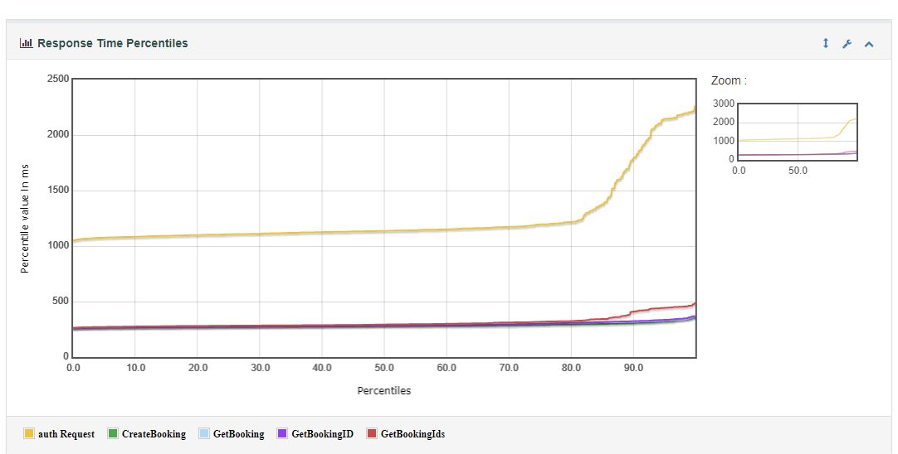
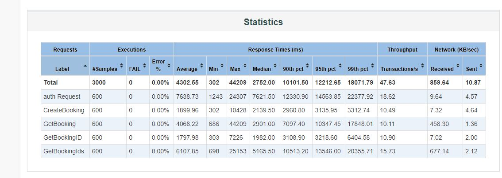
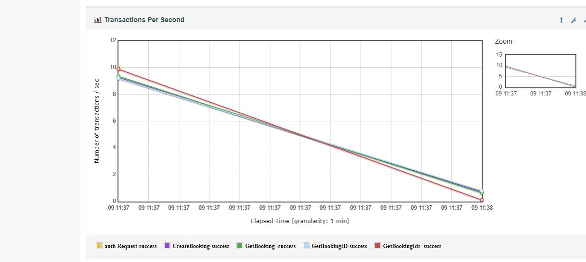
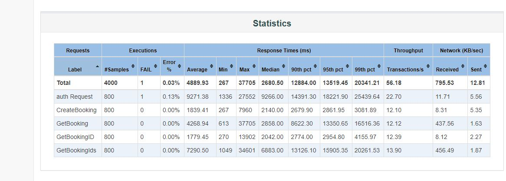
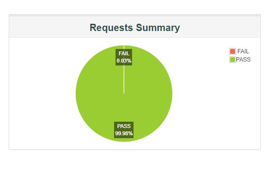

# Performance Testing for A booking Website.[Testing Site]

## Table of Contents
- [Performance Testing for Booking  Website](#performance-testing-for-booking-website)
  - [Introduction](#introduction)
  - [Author](#author)
  - [Load testing Report](#LoadtestingReport)  
  - [Install](#install)
  - [Prerequisites](#prerequisites)
  - [Test Plan](#test-plan)
  - [Collection of API](#collection-of-api)
  - [Test Execution](#test-execution)
    
  - [Conclusion](#conclusion)

## Introduction

This document explains how to run a performance test with JMeter against the Booking  Website. The performance test will help evaluate the website's performance under various load conditions.


## Author

- Author: Tashfiquzzaman

 # Load testing Report

| Concurrent Request  | Loop Count | Avg TPS for Total Samples  | Error Rate | Total Concurrent API request |
|               :---: |      :---: |                      :---: |                        :---: |      :---: |
| 1  | 1  | 6.850  | 0%      | 400   |
| 2  | 1  |  7     | 0%      | 600   |
| 3  | 1  |  11    | 0.47%   | 636   |
| 4  | 1  |  14.1  | 0.59%   | 800   |
| 5  | 1  |  17.6  | 0.94%   | 1000  |


## Install

### Prerequisites

Before running the performance test, ensure you have the following prerequisites installed:

- **Java**: [Download Java](https://www.oracle.com/java/technologies/downloads/)
- **JMeter**: [Download JMeter](https://jmeter.apache.org/download_jmeter.cgi) (Select the binary distribution)

### BlazeMeter (Optional)

We can also use BlazeMeter to generate JMX files for our performance tests. [BlazeMeter Chrome Extension](https://chrome.google.com/webstore/detail/blazemeter-the-continuous/mbopgmdnpcbohhpnfglgohlbhfongabi?hl=en)

## Test Plan

Create a test plan with the following elements:

- Thread Group: Simulates concurrent users.
- HTTP Request Defaults (Configuration Element): Set default values for HTTP requests.
- HTTP Request (Sampler): Define the HTTP requests to be executed.
- Summary Report (Listener): Collect and display test results.

## Collection of API

To perform the performance test, you'll need to collect the APIs from the Booking  Website.
Booking  Website Link:- https://restful-booker.herokuapp.com/apidoc/index.html
Here is a list of APIs you can use for testing:

- [https://restful-booker.herokuapp.com/auth](https://restful-booker.herokuapp.com/auth)
- [https://restful-booker.herokuapp.com/booking](https://restful-booker.herokuapp.com/booking)
- [https://restful-booker.herokuapp.com/booking/id](https://restful-booker.herokuapp.com/booking/id)
- [https://restful-booker.herokuapp.com/booking/1709](https://restful-booker.herokuapp.com/booking/id)
- [https://restful-booker.herokuapp.com/ping](https://restful-booker.herokuapp.com/ping)

## Test Execution

Follow these steps to execute the performance test:

1. **Load the JMeter Script:**
   - File > Open (CTRL + O)
   - Locate the appropriate JMX file for your test scenario (e.g., `Test1.jmx`).
   - Open the JMX file.
   - The Test Plan will be loaded.

2. **Run the Test:**
   - In the JMeter terminal, navigate to the `bin` folder.
   -  Open Command prompt (CMD).
   -  `jmeter -n -t Test1.jmx -l report\Test1.jtl`
   
   - Repeat the above command for different test scenarios as needed.

3. **Generate HTML Report:**
   - Execute the following command to generate an HTML report :
     ```bash
     jmeter -g report/Test1.jtl -o Test1.jtl_Report
     ```
   - This will create an HTML report in the `Report` folder.


  ### Summary

I’ve completed a performance test on frequently used API for test App. 
Test executed for the below-mentioned scenario.

- 400 Concurrent Requests with 1 Loop Count; Avg TPS for Total Samples is ~ 33.334 And Total Concurrent API requested: 2000.
- 600 Concurrent Request with 1 Loop Count; Avg TPS for Total Samples is ~ 48 And Total Concurrent API requested: 3000.
- 800 Concurrent Request with 1 Loop Count; Avg TPS for Total Samples is ~ 67 And Total Concurrent API requested: 4000.
- 1000 Concurrent Request with 1 Loop Count; Avg TPS for Total Samples is ~ 83 And Total Concurrent API requested: 5500.
- While executing 800 concurrent requests, found  5 requests got a connection timeout and an error rate is 0.0%.

- # HTML Reports         |  Errors
:-------------------------:|:-------------------------:
 -  400 Concurrent Requests with 2000 APIs (TPS).
   
  

  400 Concurrent Requests with 2000 APIs (RTP).
  
   
 600 Concurrent Requests with 3000 APIs (Statistics Result).
 

 600 Concurrent Requests with 3000 APIs (TPS).
 
 
 800 Concurrent Requests with 4000 APIs (Statistics Result 0.03% error).
  
   800 Concurrent Requests with 4000 APIs (Summary).
  - 

1000 Concurrent Requests with 5000 APIs (TTPs).


### - Summary: The server can handle almost a concurrent 3800 API calls with an error rate  of 0.94% almost 1% error rate.
## Conclusion

Performing performance testing on the Booking website helps ensure that it can handle various loads and traffic conditions effectively. By following this guide, you can assess the website's performance and make improvements as needed.
